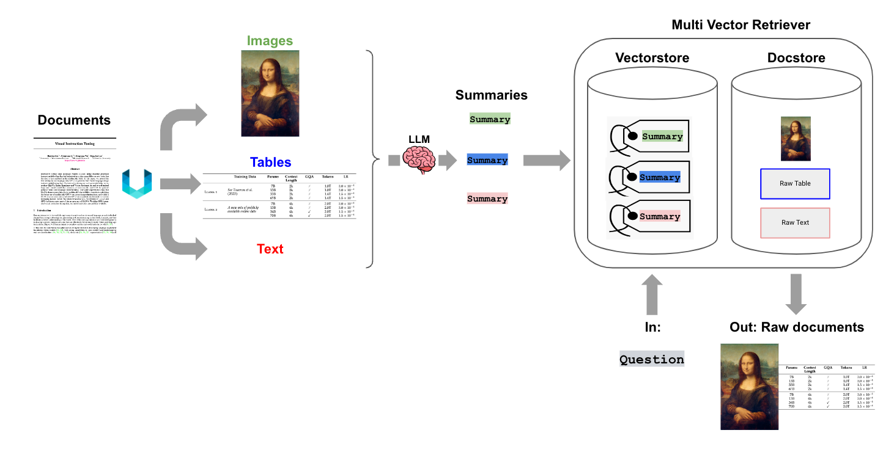

# DME Chatbot App

## Introduction
------------
The DME Chatbot App is a Python application that allows you to chat with any PDF document but in this case it can be used for DME manual specifically. You can ask questions about the PDFs using natural language, and the application will provide relevant responses based on the content of the documents. This app utilizes a language model (Llama3.1) to generate accurate answers to your queries. Please note that the app will only respond to questions related to the loaded PDF.

## How It Works
------------


The application follows these steps to provide responses to your questions:

1. PDF Loading: The app reads PDF document.

2. Text and Table Chunking: It processes the PDF to extract text and table elements and convert them into chunks
   
3. Summaries: It creates the summaries of table and text chunks that are used by retriever to retrieve relevant chunks based on the queries asked

4. Language Model: The application utilizes a language model to generate vector representations (embeddings) of the text chunks.

5. Similarity Matching: When you ask a question, the app compares it with the embedded summaries and identifies the most semantically similar ones and retrieves the original chunks corresponding to those summaries

6. Response Generation: The selected chunks are passed to the language model, which generates a response based on the relevant content of the PDFs.

## Dependencies and Installation
----------------------------
To install the DME Chatbot App, please follow these steps:

1. Clone the repository to your local machine.

2. Install the required dependencies by running the following command:
   ```
   pip install -r requirements.txt
   ```

## Usage
-----
To use the DME Chatbot App, follow these steps:

1. Ensure that you have installed the required dependencies

2. Run the `DME_chatbot_app_final.py` file using the Streamlit CLI. Execute the following command:
   ```
   streamlit run app.py
   ```

3. The application will launch in your default web browser, displaying the user interface.

4. Load PDF documents into the app by following the provided instructions.
   
5. Wait for the app to process the document by extracting chunks, creating summaries and creating embeddings

6. Ask questions in natural language about the loaded PDFs using the chat interface.

There is also a jupyter notebook that allows to run the code on google_colab or other applications without the streamlit app interface. It can be used to understand the different blocks of code and what each function does. 

## Detailed Manual
-----
To read the more detailed manual of the app, open the file 'Manual_for_DME_Chatbot_code.doc' 
